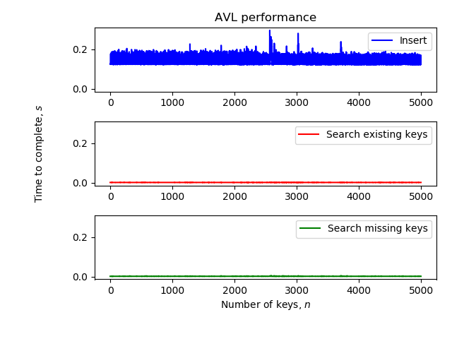
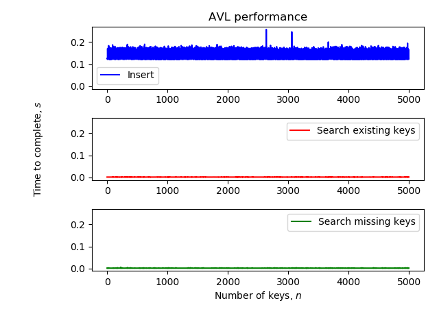
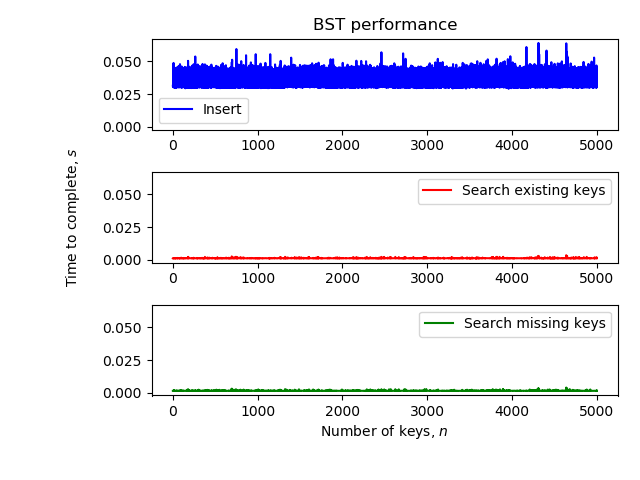
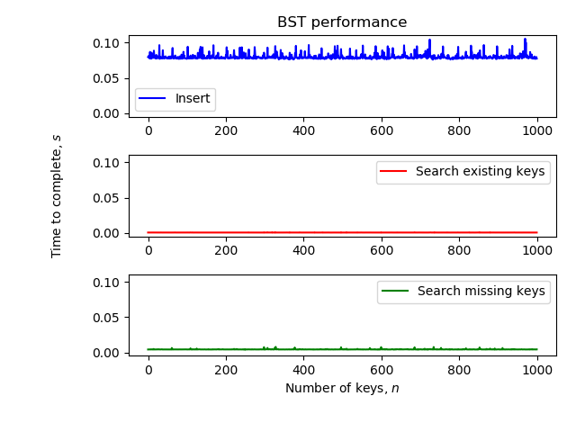
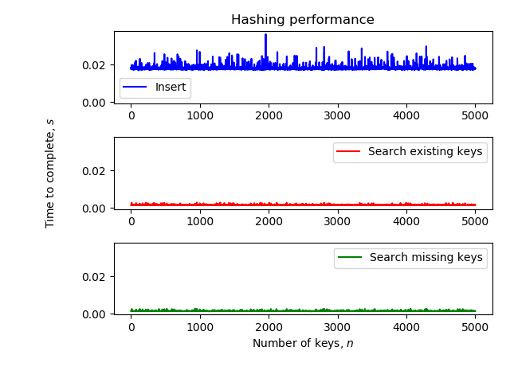

# Trees
V1.0: The goal of this assignment is to compare the performance of insertion and search operations on BST, AVL trees, and hash tables.

## Getting Started

These instructions will get you a copy of the project up and running on your local machine.

### Prerequisites

The following packages were used during the development of this code. Other versions may be supported, but cannot be guaranteed.

- python (version 3.7.0)
- pycodestyle (version 2.5.0)
- matplotlib (version 3.1.1)

### Installation

The following steps will help you set up the proper environment on your machine. All example commands are entered directly into terminal.

**Installing conda:**

```
cd $HOME
wget https://repo.anaconda.com/miniconda/Miniconda3-latest-Linux-x86_64.sh
bash Miniconda3-latest-Linux-x86_64.sh -b
. $HOME/miniconda3/etc/profile.d/conda.sh
conda update --yes conda
conda config --add channels bioconda
echo ". $HOME/miniconda3/etc/profile.d/conda.sh" >> $HOME/.bashrc
```

**Creating conda environment:**

```
conda create --yes -n <your_environment>
conda install --yes python=3.7
```

**Activating conda environment:**

```
conda activate <your_environment>
```

**Installing pycodestyle:**

pycodestyle is used to ensure that all .py files adhere to the PEP8 style guidelines.

```
conda install -y pycodestyle
```

**Installing matplotlib:**

matplotlib is used to generate the plots of the data.

```
conda install -y pycodestyle
```

### Examples

insert_key_values_pairs.py key-value pairs from a .txt file and inserts them into the specified data structure. It then searches for keys. All search and insertion functions are benchmarked and the results are saved to a .png file.

```
python insert_key_values_pairs.py data_struct data_file num_points
```

test_trees.py runs several unit tests on the binary search tree and AVL tree methods to ensure proper insertion, search, and other important functionality.

```
python test_trees.py
```

### Benchmarking Results
**AVL Sorted**


**AVL Random**


**BST Sorted**


**BST Random**


**Hash Sorted**


**Hash Random**


## Authors

**Michael W. Chifala** - University of Colorado, Boulder, CSCI 7000: Software Engineering for Scientists


## Acknowledgments

* Ryan Layer's CSCI 7000 "Development Environment" document
* Ryan Layer's CSCI 7000 "Continuous Integration with Travis CI" document
* Ryan Layer's CSCI 7000 "Test-Driven Development" document
* Ryan Layer's CSCI 7000 "Using libraries: Matplotlib" document
* Ryan Layer's CSCI 7000 "Profiling and Benchmarking" document
* Ryan Layer's CSCI 7000 "Git Submodules" document
* Ryan Layer's CSCI 7000 "Hash Table" document
* Ryan Layer's CSCI 7000 "Trees" document
* PEP8 Style Guidelines: https://www.python.org/dev/peps/pep-0008/
* Github: PurpleBooth/README-Template.md
* AVL Tree code: https://rosettacode.org/wiki/AVL_tree#Python
